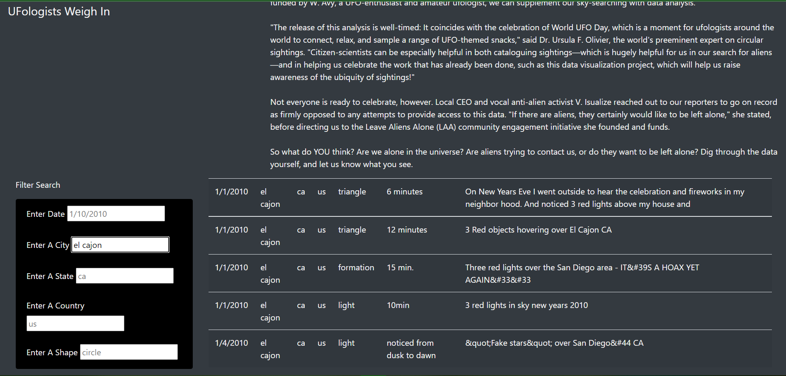
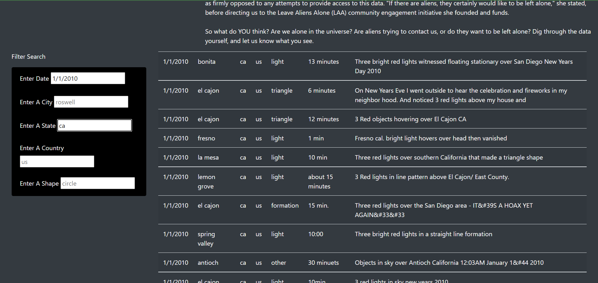
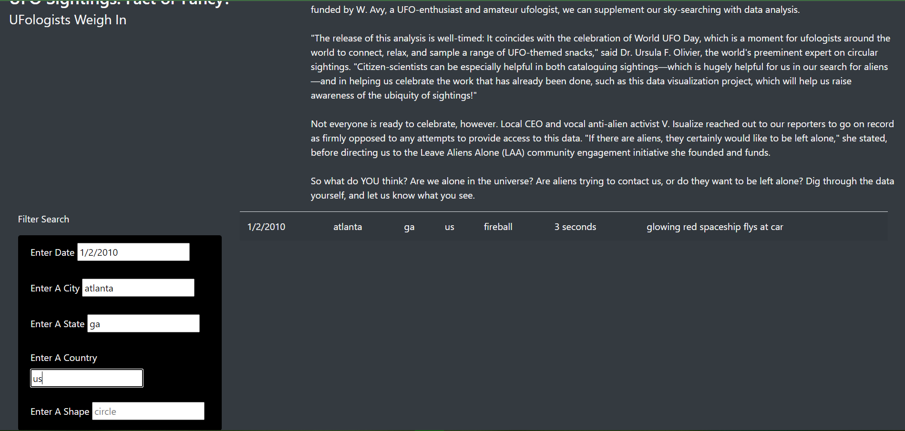
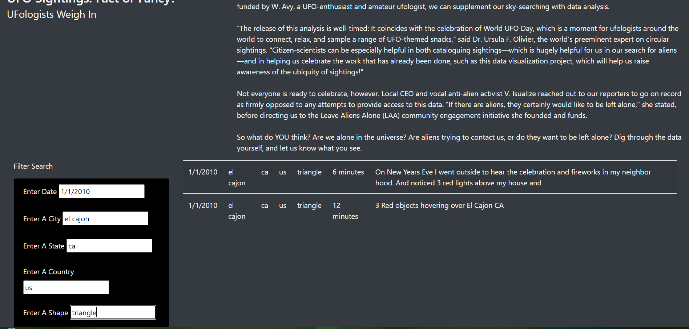

# UFO Sightings Project

## Project Overview

The client Dana has hired us to create a webpage that can retrieve key UFO sighing data for her analyses. We used HTML, JavaScript, and CSS to create the site. The webpage is backed by a dataset of about 100 separate UFO sightings. We will discuss how the site works in the next section and how Dana and any other user can utilize it to perform analyses.

## Results

Dana can use the site by manipulating he filters that are tailored towards the data’s main categories. Currently, there are filters for the date of the sighting, city, state, country, and shape of the UFO that someone sighted. Dana has the flexibility to manipulate one, some, or all five of the filters in order to retrieve the specific type of data she is looking for. Let us take a look at some scenarios in which Dana may want to filter the data. Please note, if the reader wishes to refresh the table after applying each type of filter, then she can go to the top of the page and click on the left-hand side button titled “UFO Sightings”.

*Scenario One: Using A Single Filter* 

Dana has the ability to calibrate the data retrieval process by changing any one of the five filters. Here, we are going to demonstrate by changing the city filter by entering “el cajon”. After entering the data, Dana needs to hit enter (or she can click somewhere else on the page or hit tab to achieve the same results) in order to instruct the website to retrieve all the records for the city El Cajon. **Figure 1-1** shows the results of this filter with five records for the city El Cajon showing up:

*Scenario Two: Applying 2 - 4 Filters*

Refresh the table by clicking on the top, upper-left hand button titled “UFO Sightings”. Now to see how the filters work with multiple criteria, please input “1/1/2010”, hit enter, and then for the state filter input “ca” and hit enter. Sixteen records should be returned for this criterion. **Figure 1-2** provides a snippet of what the data should look like:

Notice how the table ONLY returns data that meets the criteria “1/1/2010” for date AND “ca” for state and DOES NOT return all the instances that have EITHER of those criteria. We refractured the code to ensure that this logical consistency was met.

Finally, we will skip utilizing three search criteria and proceed to enter four. Refresh the page and enter the following criteria:

•	For date, enter “1/2/2010”

•	For city, enter “atlanta”

•	For state, enter “ga”

•	For country, enter “us”

There should be one record that shows up. **Figure 1-3** displays what the website should look like after inputting this criterion. 

Before refreshing, delete “ga” in the state filter, input “tx” and hit enter. Notice how the table now shows nothing which is the correct representation. If you enter the wrong criteria for any of the filters, the table will show no data at all. Now, delete “tx” in the state filter, re-input “ga” and hit enter. Notice, the one record that was previously shown is redisplayed by the table. This example shows the dynamicism of the website in that you do not have to keep refreshing the page every time you make a mistake or a change to your criteria (but it is good to refresh before you enter a new criteria just to ensure that there are no mistakes).

*Scenario Three: Inputting Data For All Filters*

Refresh the page and input data for all five filters:

•	For date, enter “1/1/2010”.

•	For city, enter “el cajon”.

•	For state, enter “ca”.

•	For country, enter “us”.

•	For shape, enter “triangle”.

After inputting the results, Dana should notice that two records are retrieved. Figure 1-4 displays the results of the search:

A general observation Dana could make through all these search scenarios is that the more filters that she enters, the narrower are her search results. 

## Summary

One drawback of this design is that there is no search criteria for comments, which might be the most important criteria for ascertaining the veracity of these UFO sightings. Dana would need to somehow calibrate the search that show keywords in certain comment sections in order to identify trends, consistencies, or other types of patterns within the dataset. This facet would be much more useful than having the search engine display only the data that meets all of her search criteria instead of key words because the results returned would be much narrower and therefore more limiting for her analyses.

Finally, she may want to find a data set that includes images. This way, when users enter a shape or some other criteria for image description, they can exactly see what observer saw when they spotted the UFO. This not only provides more substantiation to the observers’ claims, but also allows Dana and her fans to compare and contrast images across UFO sightings, thereby allowing her to identify trends and other patterns that would strengthen her analyses and conclusions. 

Utilizing javascript to create filtered tables that can manipulate UFO siting data.
